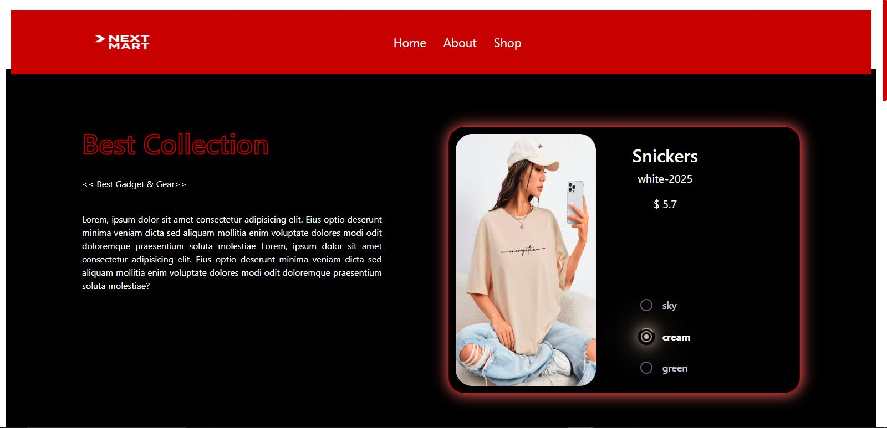

# 🛍️ Multi Product Page Website

## 📖 Overview

The **Multi Product Page Website** is a stylish and responsive web project designed to display multiple products with beautiful visuals and interactive elements. It provides users with a seamless experience while browsing through various product options.

## ✨ Features

* 🖼️ **Product Gallery:** Showcase multiple products with images, names, and prices.
* 🎨 **Interactive Design:** Smooth hover effects and transitions for an engaging user experience.
* 📱 **Responsive Layout:** Automatically adjusts to all screen sizes using CSS media queries.
* 🧭 **Simple Navigation:** Clean and minimal header for easy browsing.
* 🧩 **Color Variations:** Change product colors dynamically with JavaScript.
* 🌗 **Modern UI:** Soft shadows, rounded corners, and elegant typography.

## 🛠️ Technologies Used

* **HTML5** – For semantic structure.
* **CSS3 / Bootstrap 5** – For layout, styling, and responsiveness.
* **JavaScript (ES6)** – For interactivity and dynamic features.

## 📷 Preview
## Screenshots

## 🚀 Future Improvements

* Add shopping cart functionality
* Connect with a backend API for dynamic product data
* Implement product filtering, sorting, and search functionality

##  Deployed (Render)

[🔗 [Open live demo — multi-product-pages.vercel.app](https://multi-product-pages.vercel.app/)]

## 👩‍💻 Author

Developed with ❤️ by **Somaya Ataie**
💼 Computer Science Engineer & Web Developer

**Somaya Ataie**  
[GitHub Profile](https://github.com/somayaataee)

